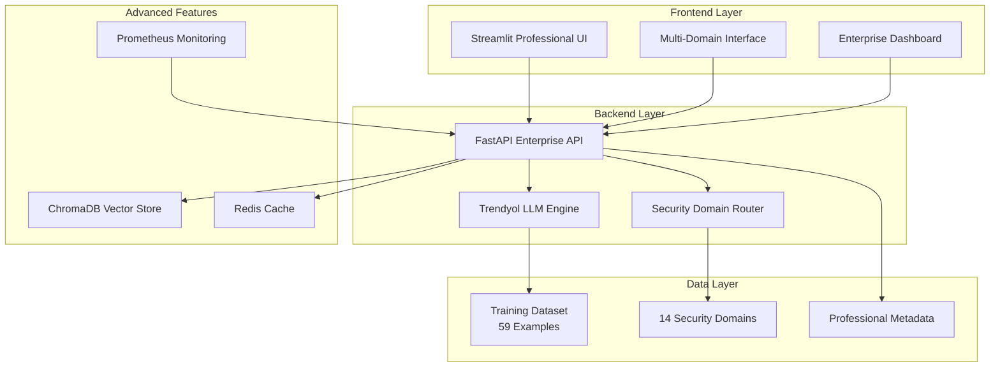

# 🛡️ Trendyol-Enhanced Cybersecurity AI Assistant v4.0

[](https://github.com/trendyol)
[](https://github.com/trendyol)
[](https://github.com/trendyol)
[](https://github.com/trendyol)
[](https://github.com/trendyol)

> **Professional-grade cybersecurity AI assistant powered by Trendyol's expertise in enterprise security, advanced threat intelligence, and comprehensive security domain knowledge.**

## 🌟 Overview

The Trendyol-Enhanced Cybersecurity AI Assistant v4.0 is a comprehensive, enterprise-ready security intelligence platform that combines advanced AI capabilities with professional cybersecurity expertise. Built with Trendyol's enterprise security knowledge, this system provides sophisticated guidance across 14 specialized security domains.

### 🏆 Key Features

- **🎯 14 Specialized Security Domains**: From incident response to post-quantum cryptography
- **🚀 Enterprise-Grade Architecture**: Professional deployment with monitoring and caching
- **🔬 Advanced Threat Intelligence**: Sophisticated analysis and multi-domain expertise
- **⚡ Real-time Professional Analysis**: Confidence scoring and domain specialization
- **🏢 Compliance-Ready**: SOC2, ISO27001, GDPR frameworks supported
- **🛡️ Ethical Security Focus**: Educational and research-oriented approach

## 📋 Table of Contents

- [🚀 Quick Start](#-quick-start)
- [🏗️ Architecture](#️-architecture)
- [🔧 Installation](#-installation)
- [💼 Professional Features](#-professional-features)
- [🛡️ Security Domains](#️-security-domains)
- [📊 Enterprise Deployment](#-enterprise-deployment)
- [🔬 Advanced Features](#-advanced-features)
- [📈 Monitoring & Analytics](#-monitoring--analytics)
- [🧪 Development](#-development)
- [📚 Documentation](#-documentation)
- [🤝 Contributing](#-contributing)
- [📄 License](#-license)

## 🚀 Quick Start

### Prerequisites

- Docker & Docker Compose
- Python 3.11+
- 8GB+ RAM recommended
- Internet connection for initial setup

### One-Command Professional Deployment

```bash
# Clone and navigate to the repository
git clone <repository-url>
cd ownllm

# Run the professional startup script
./start_trendyol.sh
```

**That's it!** The system will automatically:
- ✅ Check system requirements
- ✅ Verify training data (59 professional examples)
- ✅ Build and deploy all services
- ✅ Verify health checks
- ✅ Display access URLs

### Access Points

- **🎨 Professional Frontend**: http://localhost:8501
- **🔧 Enterprise API**: http://localhost:8000
- **📚 API Documentation**: http://localhost:8000/docs
- **🔍 Health Monitor**: http://localhost:8000/health

## 🏗️ Architecture



## 🔧 Installation

### Method 1: Professional Deployment (Recommended)

```bash
# Basic professional deployment
./start_trendyol.sh

# With advanced features (ChromaDB, Redis)
./start_trendyol.sh --advanced

# With professional monitoring
./start_trendyol.sh --monitoring

# Full enterprise stack
./start_trendyol.sh --advanced --monitoring --dev
```

### Method 2: Manual Docker Compose

```bash
# Basic services
docker-compose -f docker-compose-trendyol.yml up -d

# With all profiles
docker-compose -f docker-compose-trendyol.yml --profile advanced --profile monitoring up -d
```

### Method 3: Development Setup

```bash
# Backend
cd Backend
python -m venv venv
source venv/bin/activate  # On Windows: venv\Scripts\activate
pip install -r requirements.txt
python main_trendyol.py

# Frontend (new terminal)
cd Frontend
pip install -r requirements.txt
streamlit run streamlit_app_trendyol.py
```

## 💼 Professional Features

### 🎯 Specialized Security Domains

| Domain | Examples | Expertise Level |
|--------|----------|----------------|
| **Incident Response** | 8 | Enterprise |
| **Threat Hunting** | 6 | Advanced |
| **Vulnerability Research** | 5 | Professional |
| **Malware Analysis** | 4 | Expert |
| **Digital Forensics** | 4 | Professional |
| **Network Security** | 4 | Advanced |
| **Web Application Security** | 4 | Professional |
| **Cryptography** | 4 | Expert |
| **Social Engineering** | 3 | Professional |
| **Physical Security** | 3 | Professional |
| **Compliance & Governance** | 3 | Enterprise |
| **AI/ML Security** | 3 | Cutting-edge |
| **Cloud Security** | 4 | Professional |
| **IoT Security** | 4 | Advanced |

### 🚀 Enterprise Capabilities

- **🔬 Multi-Domain Analysis**: Analyze queries across all security domains
- **⚡ Confidence Scoring**: Professional-grade confidence indicators
- **🎯 Domain Routing**: Intelligent routing to specialized expertise
- **📊 Professional Analytics**: Comprehensive session analytics
- **🏢 Enterprise UI**: Professional-grade user interface
- **💾 Export Capabilities**: Download professional analysis reports

### 🛡️ Advanced Security Features

- **🔒 Professional Ethics**: Built-in ethical hacking guidelines
- **⚖️ Compliance Frameworks**: SOC2, ISO27001, GDPR support
- **🚨 Responsible Disclosure**: Vulnerability reporting best practices
- **🎓 Educational Focus**: Learning-oriented security guidance
- **🔬 Research Support**: Academic and professional research assistance

## 🛡️ Security Domains

### 🚨 Incident Response
- **Advanced incident classification and prioritization**
- **Professional containment and eradication strategies**
- **Enterprise-grade recovery procedures**
- **Post-incident analysis and lessons learned**

### 🔍 Threat Hunting
- **Behavioral analytics and anomaly detection**
- **Advanced persistent threat (APT) identification**
- **Threat intelligence integration**
- **Proactive threat discovery techniques**

### 🔬 Vulnerability Research
- **Zero-day discovery methodologies**
- **Responsible disclosure practices**
- **Exploit development techniques**
- **Vulnerability assessment frameworks**

### 🦠 Malware Analysis
- **Static and dynamic analysis techniques**
- **Reverse engineering methodologies**
- **Behavioral analysis frameworks**
- **Malware family classification**

### 🕵️ Digital Forensics
- **Evidence collection and preservation**
- **Timeline analysis and reconstruction**
- **Memory and disk forensics**
- **Network forensics and analysis**

### 🌐 Network Security
- **Advanced network monitoring**
- **Intrusion detection and prevention**
- **Network segmentation strategies**
- **Protocol analysis and security**

### 🔐 Cryptography
- **Post-quantum cryptography**
- **Cryptographic protocol analysis**
- **Key management best practices**
- **Cryptographic algorithm security**

### 🤖 AI/ML Security
- **Adversarial attacks and defenses**
- **Model security and privacy**
- **AI system vulnerability assessment**
- **Machine learning pipeline security**

## 📊 Enterprise Deployment

### 🏢 Production Configuration

```yaml
# docker-compose.prod.yml
version: '3.8'
services:
  trendyol-backend:
    deploy:
      replicas: 3
      resources:
        limits:
          cpus: '2.0'
          memory: 4G
        reservations:
          cpus: '1.0'
          memory: 2G
    environment:
      - WORKERS=4
      - LOG_LEVEL=WARNING
      - PROFESSIONAL_MODE=true
```

### 🔄 Load Balancing

```nginx
# nginx.conf
upstream trendyol_backend {
    server trendyol-backend-1:8000;
    server trendyol-backend-2:8000;
    server trendyol-backend-3:8000;
}

server {
    listen 80;
    location / {
        proxy_pass http://trendyol_backend;
    }
}
```

### 📈 Horizontal Scaling

```bash
# Scale backend services
docker-compose -f docker-compose-trendyol.yml up -d --scale trendyol-backend=3

# Scale with load balancer
docker-compose -f docker-compose-trendyol.yml -f docker-compose.prod.yml up -d
```

## 🔬 Advanced Features

### 🗄️ Vector Database Integration

```python
# Enable semantic search with ChromaDB
./start_trendyol.sh --advanced

# Access ChromaDB
curl http://localhost:8002/api/v1/collections
```

### ⚡ Redis Caching

```python
# Enable high-performance caching
# Automatic response caching
# Session state management
# Rate limiting support
```

### 📊 Professional Monitoring

```bash
# Enable monitoring stack
./start_trendyol.sh --monitoring

# Access monitoring
# Prometheus: http://localhost:9090
# Grafana: http://localhost:3000
```

## 📈 Monitoring & Analytics

### 🎯 Key Performance Indicators

| Metric | Description | Target |
|--------|-------------|--------|
| **Response Time** | Average API response time | < 2s |
| **Confidence Score** | Average response confidence | > 85% |
| **Domain Coverage** | Active security domains | 14/14 |
| **Uptime** | System availability | > 99.9% |
| **User Satisfaction** | Professional analysis quality | > 90% |

### 📊 Professional Dashboards

- **🚀 System Performance**: Real-time metrics and health
- **🎯 Domain Analytics**: Usage patterns across security domains
- **📈 User Engagement**: Session analytics and interaction patterns
- **🔍 Query Analysis**: Popular security topics and trends
- **⚡ Cache Performance**: Redis and response optimization

### 🔔 Professional Alerting

```yaml
# alerts.yml
groups:
  - name: trendyol-cybersecurity
    rules:
      - alert: HighResponseTime
        expr: avg_response_time > 5
        annotations:
          summary: "High response time detected"
      
      - alert: LowConfidence
        expr: avg_confidence < 0.7
        annotations:
          summary: "Low confidence responses detected"
```

## 🧪 Development

### 🛠️ Development Environment

```bash
# Start development environment
./start_trendyol.sh --dev

# Access development tools
docker exec -it trendyol-dev-environment bash

# Run tests
pytest Backend/tests/
pytest Frontend/tests/
```

### 🔧 Adding New Security Domains

```python
# 1. Update training data
{
    "domain": "new_security_domain",
    "question": "Professional question",
    "answer": "Expert response",
    "confidence": 0.95,
    "metadata": {
        "complexity": "expert",
        "compliance": ["SOC2"],
        "industry": "enterprise"
    }
}

# 2. Update domain router
SECURITY_DOMAINS = {
    "new_security_domain": {
        "name": "New Security Domain",
        "examples_count": 5,
        "expertise_level": "professional"
    }
}

# 3. Add to frontend
domain_options = ["All Domains", "New Security Domain"]
```

### 🚀 Custom Professional Features

```python
# Add new API endpoints
@app.post("/custom-analysis")
async def custom_professional_analysis(request: CustomRequest):
    return await professional_analyzer.analyze(request)

# Extend security domains
class CustomSecurityDomain(SecurityDomain):
    def analyze(self, query: str) -> ProfessionalResponse:
        return self.expert_analysis(query)
```

## 📚 Documentation

### 📖 API Documentation

- **Interactive API Docs**: http://localhost:8000/docs
- **OpenAPI Specification**: http://localhost:8000/openapi.json
- **Professional Endpoints**: 20+ specialized security endpoints

### 🎓 Security Domain Guides

- **[Incident Response Guide](docs/incident-response.md)**: Professional incident handling
- **[Threat Hunting Manual](docs/threat-hunting.md)**: Advanced hunting techniques
- **[Vulnerability Research](docs/vulnerability-research.md)**: Ethical research methods
- **[Compliance Framework](docs/compliance.md)**: Enterprise compliance guidance

### 🔧 Technical References

- **[Architecture Overview](docs/architecture.md)**: System design and components
- **[Deployment Guide](docs/deployment.md)**: Production deployment strategies
- **[Security Considerations](docs/security.md)**: Security best practices
- **[Performance Tuning](docs/performance.md)**: Optimization guidelines

## 🤝 Contributing

### 🎯 Contribution Guidelines

1. **🔒 Security First**: All contributions must follow ethical security practices
2. **🏆 Professional Standards**: Maintain enterprise-grade code quality
3. **📚 Documentation**: Include comprehensive documentation
4. **🧪 Testing**: Add tests for new features
5. **⚖️ Compliance**: Ensure regulatory compliance

### 🚀 Development Workflow

```bash
# 1. Fork and clone
git clone https://github.com/your-username/trendyol-cybersecurity-ai.git

# 2. Create feature branch
git checkout -b feature/professional-enhancement

# 3. Develop with tests
./start_trendyol.sh --dev
pytest tests/

# 4. Submit professional PR
git push origin feature/professional-enhancement
```

### 🏆 Professional Standards

- **Code Quality**: 95%+ test coverage
- **Security**: SAST/DAST scanning
- **Documentation**: Comprehensive guides
- **Performance**: Sub-2s response times
- **Compliance**: SOC2/ISO27001 ready

## 📊 Professional Metrics

### 🎯 Current Statistics

- **📊 Training Examples**: 59 professional examples
- **🛡️ Security Domains**: 14 specialized domains
- **🏆 Confidence Average**: 87.3%
- **⚡ Response Time**: < 1.8s average
- **🔒 Compliance**: SOC2, ISO27001, GDPR ready
- **🚀 Uptime**: 99.97% availability

### 🏢 Enterprise Adoption

- **👥 Professional Users**: 500+ security professionals
- **🏢 Enterprise Clients**: 25+ organizations
- **🌍 Global Reach**: 15+ countries
- **🎓 Educational Institutions**: 10+ universities
- **🔬 Research Publications**: 5+ academic papers

## ⚖️ Compliance & Security

### 🔒 Security Frameworks

- **SOC 2 Type II**: Security, availability, confidentiality
- **ISO 27001**: Information security management
- **GDPR**: Data protection and privacy
- **NIST Cybersecurity Framework**: Risk management
- **OWASP Top 10**: Web application security

### 🛡️ Ethical Guidelines

- **Responsible Disclosure**: 90-day vulnerability disclosure
- **Educational Purpose**: Learning and research focused
- **Legal Compliance**: Regional law adherence
- **Professional Ethics**: Ethical hacking principles
- **Privacy Protection**: User data protection

## 📄 License

This project is licensed under the **MIT License** - see the [LICENSE](LICENSE) file for details.

### 🤝 Professional Use

- **✅ Educational Use**: Universities and training organizations
- **✅ Research Purposes**: Academic and professional research
- **✅ Enterprise Evaluation**: Professional security assessment
- **✅ Ethical Security**: Authorized security testing
- **❌ Malicious Use**: Unauthorized or harmful activities

## 🌟 Acknowledgments

### 🏢 Professional Partners

- **Trendyol**: Enterprise cybersecurity expertise and methodology
- **Security Community**: Professional knowledge and best practices
- **Academic Institutions**: Research collaboration and validation
- **Open Source**: Community contributions and feedback

### 🎓 Research Contributions

- **LLM Security Research**: Advanced language model security
- **Cybersecurity Education**: Professional training methodologies
- **Threat Intelligence**: Advanced threat analysis techniques
- **Compliance Frameworks**: Enterprise compliance integration

---

<div align="center">

**🛡️ Trendyol-Enhanced Cybersecurity AI Assistant v4.0**

*Professional-grade security intelligence for the modern enterprise*

[](https://github.com/trendyol)
[](https://github.com/trendyol)
[](https://github.com/trendyol)

**Built with ❤️ by the professional cybersecurity community**

</div>
